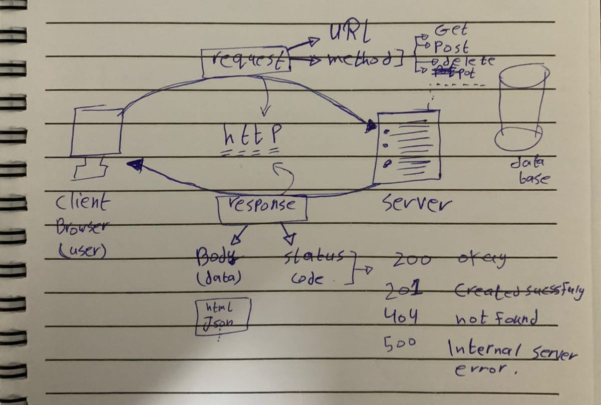

# Movies-Library - Project Version:

**Author Name**: Rawan Yaghmour

## WRRC image

## Overview

## Getting Started
To build and run the Movies-Library application on your own machine, follow these steps:

1. **Install Node.js**: Ensure that Node.js is installed on your machine. You can download and install it from the official Node.js website: https://nodejs.org

2. **Create a Project Directory**:

3. **Initialize a Node.js Project**: Open a terminal or command prompt, use this command:
    ```
    npm init -y
    ```

4. **Install Express.js**: Express.js is a web application framework for Node.js. Install it as a dependency for your project by running the following command in your terminal:
    ```
    npm install express
    ```

5. **Create a JavaScript File**: Create a new JavaScript file (e.g., `index.js`) in your project directory and copy the provided code into it.

6. **Run the Application**: In your terminal, navigate to your project directory containing `index.js` and run the following command to start the server:
    ```
    node app.js
    ```

7. **Test the Application**: Once the server is running, open a web browser and go to `http://localhost:3001` (assuming you've used the default port). You should see "Hello World!" displayed in the browser.


## Project Features
The app is a basic Express.js server with 3 route:

**1-routes using the GET request** 

**2-handling and error management** for server errors (status 500) and "page not found" errors (status 404).